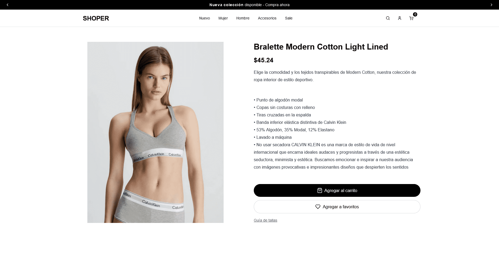

# Full-Stack E-Commerce Application



## 🚀 Description

A modern and robust e-commerce application built with Next.js 15, TypeScript, Tailwind CSS, and Sanity CMS. This application offers a seamless shopping experience with features like user authentication, cart management, and a headless CMS for product management.

## ✨ Features

- 🛍️ Dynamic product catalog
- 🔐 User authentication with Clerk
- 🛒 Shopping cart management with Zustand
- 📱 Responsive and modern design
- 🎨 Custom UI with Tailwind CSS and Radix UI
- 🖼️ Content management with Sanity CMS
- ⚡ Optimized performance with Next.js 15
- 🔄 Global state with Zustand
- 🎭 Smooth animations with Framer Motion

## 🛠️ Tech Stack

### Frontend

- Next.js 15.1.0
- React 19
- TypeScript
- Tailwind CSS
- Framer Motion
- Radix UI Components
- Clerk Authentication

### Backend & CMS

- Sanity v3
- Next.js API Routes
- Clerk Authentication

### State & Management

- Zustand for global state
- Sanity Client for content management

### Comands for code formatting

bun install --save-dev eslint eslint-config-next
bunx eslint --init

npm install --save-dev prettier eslint-config-prettier eslint-plugin-prettier

## 🚀 Quick Start

1. **Clone the repository**

   ```bash
   git clone [repository-url]
   cd Full-Stack-E-Commerce
   ```

2. **Install dependencies**

   ```bash
   bun install
   ```

3. **Set up environment variables**
   Create a `.env.local` file based on `.env.example`:

   ```env
   NEXT_PUBLIC_SANITY_PROJECT_ID=your-project-id
   NEXT_PUBLIC_SANITY_DATASET=production

   NEXT_PUBLIC_BASE_URL=http://localhost:3000

   <!-- La misma clave -->
   NEXT_PUBLIC_CLERK_PUBLISHABLE_KEY=your-clerk-key
   CLERK_SECRET_KEY=your-clerk-secret

   <!-- La misma clave -->
   SANITY_API_READ_TOKEN=your-sanity-token=
   NEXT_PUBLIC_STRIPE_PUBLISHABLE_KEY=

   STRIPE_SECRET_KEY=
   <!-- Crearla usando el Cli de Stripe -->
   STRIPE_WEBHOOK_SECRET=
   ```

4. **Start the development server**

   ```bash
   # Development with Turbopack
   bun run dev

   # Development with Sanity Studio
   bun run dev:sanity
   ```

## 📁 Project Structure

```
├── app/                # Next.js routes and pages
├── components/         # Reusable components
│   ├── ui/            # Base UI components
│   └── ...            # Other components
├── lib/               # Utilities and configurations
├── public/            # Static files
├── sanity/            # Sanity configuration and schemas
├── store/             # Global state with Zustand
└── types/             # TypeScript type definitions
```

## 🧩 Core Components

- `Header.tsx`: Main navigation and cart
- `ProductGrid.tsx`: Product grid display
- `AddToBasketButton.tsx`: Cart management
- `BlackFridayBanner.tsx`: Promotional banner
- `ProductThumb.tsx`: Product preview

## 🔧 Hooks and Utilities

- Zustand store for cart management
- Custom hooks for products and categories
- Sanity utilities for image and content management

## 📚 API Documentation

The application uses the following APIs:

- Clerk for authentication
- Sanity for content management
- Next.js API Routes for custom endpoints

## 🎨 Design and UI

- Custom design system with Tailwind CSS
- Radix UI components for accessibility
- Framer Motion animations
- Responsive design for all screens

## Dependencies and Scripts

```json
"dependencies": {
   "@commitlint/cli": "^19.6.0",
   "@commitlint/config-conventional": "^19.6.0",
   "commitlint": "^19.6.0",
   "eslint": "9.17.0",
   "eslint-config-prettier": "^9.1.0",
   "eslint-plugin-prettier": "^5.2.1",
   "husky": "^9.1.7",
   "prettier": "^3.4.2",
}

//  Commands for Husky:

npx husky add .husky/pre-commit "bun run format && bun run lint"
npx husky add .husky/commit-msg "bun x --no-install commitlint --edit $1"
```

## 🤝 Contributing

Contributions are welcome. Please follow these steps:

1. Fork the repository
2. Create a feature branch
3. Commit your changes
4. Push to the branch
5. Open a Pull Request

## 🔜 Roadmap

- [ x ] Add multiple payment gateways
- [ ] Implement wishlist functionality
- [ ] Add product reviews and ratings
- [ x ] Integrate email notifications
- [ ] Add social sharing features
- [ ] Implement advanced filtering options
- [ ] Add multi-language support
- [ ] Integrate with multiple shipping providers

## 💡 Best Practices

- Follows Next.js 15 best practices
- Implements modern React patterns
- Uses TypeScript for type safety
- Follows accessibility guidelines
- Implements SEO best practices
- Uses modern CSS techniques
- Follows security best practices
- Implements performance optimizations

## 📝 License

This project is under the MIT License.

## 👥 Author

[Deus lo vult]
